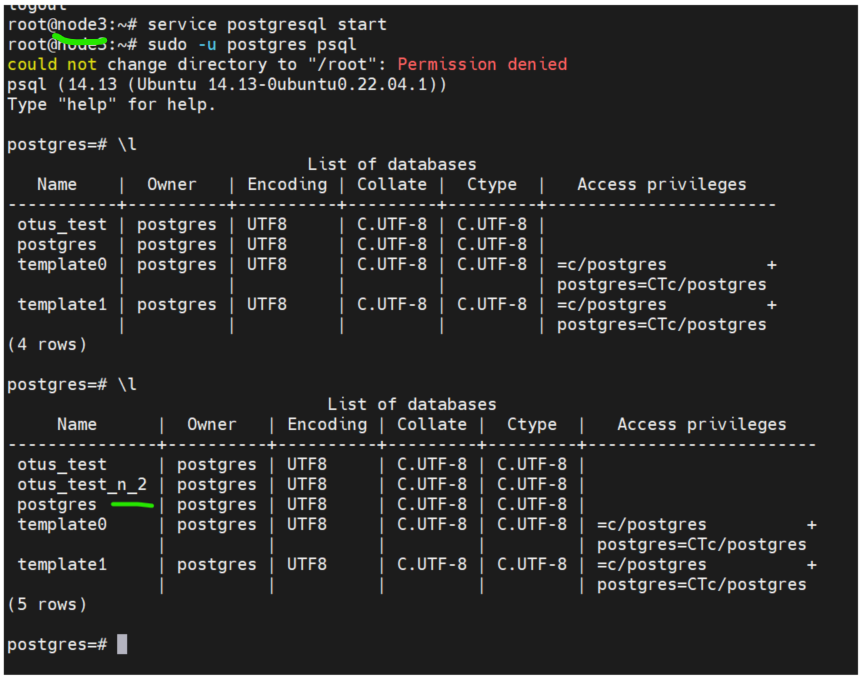
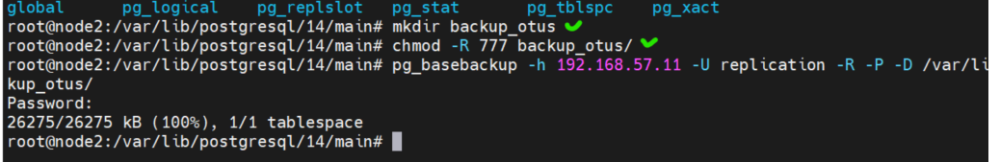
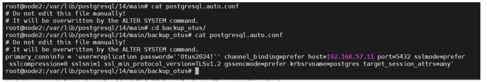

# homework-postgres_backup

Описание домашнего задания
---
1) Настроить hot_standby репликацию с использованием слотов


2) Настроить правильное резервное копирование


---
ОС для настройки: Ubuntu 22.04

Vagrant версии 2.4.1

VirtualBox версии 7.0.18

---
- Этап 1: Создаем Vagrantfine, запускаем ВМ.

После того, как VM развернулись, получаем 3 хоста:

**Node1**, **Node3**, **Barman**


**PS** Node2 пала смертью храбрых в процессе тестирования решения проблем. Описано ниже. Поэтому на некоторых скринах еще виднеется node2, Считать равносильным node3.


**PS PS** **ВАЖНО!!!*** В ходе работы я сталкивался с разными ошибками. Описан будет полный ход, ВКЛЮЧАЯ неверные шаги!! Поэтому, чтобы предотвратить их повторения в будщем, используя это руководство, я буду ставить отметки **НЕВЕРНЫЙ ШАГ** с примечанием, где описано исправление  

---
- Этап 2: Настройка hot_standby репликации с использованием слотов.

**На node1 + node3**


**Устанавливаем postgresql-server 14, стартуем, добавляем в автозагрузку**


```bash
apt install postgresql postgresql-contrib
systemctl start postgresql
systemctl enable postgresql
```


---
**На хосте node1**


**Заходим в psql**

```bash
sudo -u postgres psql
```


---
**НЕВЕРНЫЙ ШАГ_1** 
---


**В psql создаём пользователя replicator c правами репликации и паролем «Otus2024!»**

```bash
CREATE USER replicator WITH REPLICATION Encrypted PASSWORD 'Otus2022!';
```


---
**В файле /etc/postgresql/14/main/postgresql.conf указываем следующие параметры**


```bash
#Указываем ip-адреса, на которых postgres будет слушать трафик на порту 5432 (параметр port)
listen_addresses = 'localhost, 192.168.57.11'
#Указываем порт порт postgres
port = 5432 
#Устанавливаем максимально 100 одновременных подключений
max_connections = 100
log_directory = 'log' 
log_filename = 'postgresql-%a.log' 
log_rotation_age = 1d 
log_rotation_size = 0 
log_truncate_on_rotation = on 
max_wal_size = 1GB
min_wal_size = 80MB
log_line_prefix = '%m [%p] ' 
#Указываем часовой пояс для Москвы
log_timezone = 'UTC+3'
timezone = 'UTC+3'
datestyle = 'iso, mdy'
lc_messages = 'en_US.UTF-8'
lc_monetary = 'en_US.UTF-8' 
lc_numeric = 'en_US.UTF-8' 
lc_time = 'en_US.UTF-8' 
default_text_search_config = 'pg_catalog.english'
#можно или нет подключаться к postgresql для выполнения запросов в процессе восстановления; 
hot_standby = on
#Включаем репликацию
wal_level = replica
#Количество планируемых слейвов
max_wal_senders = 3
#Максимальное количество слотов репликации
max_replication_slots = 3
#будет ли сервер slave сообщать мастеру о запросах, которые он выполняет.
hot_standby_feedback = on
#Включаем использование зашифрованных паролей
password_encryption = scram-sha-256
```


---
**Настраиваем параметры подключения в файле /etc/postgresql/14/main/pg_hba.conf** Добавляем строки в конец


```bash
host    replication replication    192.168.57.11/32        scram-sha-256
host    replication replication    192.168.57.12/32        scram-sha-256
```


---
**Перезапускаем postgresql-server** 


```bash
systemctl restart postgresql
```


---
**ПЕРЕХОДИМ на хост node3**


**Останавливаем postgresql-server**


```bash
systemctl stop postgresql
```


---
**С помощью утилиты pg_basebackup копируем данные с node1**


**команда из методички с ошибкой** "pg_basebackup -h 192.168.57.11 -U    /var/lib/postgresql/14/main/ -R -P"


**Верная команду вот**

```bash
#логинимся в пользователя postgres (Этот шаг ВЕРНЫЙ, но на скрине я сначала упустил его)
su - postgres
#пробуем подключиться
pg_basebackup -h 192.168.57.11 -U replication -R -P -D /var/lib/postgresql/14/main/
```


**Получаем ошибку доступа** Долго разбираемся, почему. 

Пользователь кому разрешена репликация у нас replicat**ion**, мы указывали его в конфиге на node1


**Но** создавали мы вроде другого пользователя?...replicat**or**


---
**_ВЕРНЫЙ ШАГ_1**
---
**Создадим другого пользователя** (либо можно было внести изменения в конфиг, но я решил так)


**Повторим попытку подклчючения** Но упираемся в другую проблему! Этот момент в методичке не описан


Ковырялся я с ним довольно долго, и именно тут убил node2, поэтому опишу эти попытки в самом конце работы. 


**Сразу к верному решению**


1) Логинимся под пользователем postgres
2) Удаляем дефолтную директорию
3) Создаем новую, с таким же названием
4) Даем ей права
5) Проверяем
6) Только теперь пробуем подключиться


**В файле  /etc/postgresql/14/main/postgresql.conf меняем параметр**


```bash
listen_addresses = 'localhost, 192.168.57.12'
```


**Запускаем службу**

```bash
systemctl start postgresql
```

---
**Проверяем репликацию**


**Переходим на хост node1** и логинимся в psql


```bash
#создадим базу otus_test_N_2 
CREATE DATABASE otus_test;
#и выведем список БД
\l
```


---
**На хосте node3** также в psql проверим список БД (команда \l), в списке БД должна появится БД otus_test_N_2

**Примечание** На скрине ниже показан вывод списка БД **ДО** создания на node1 и **ПОСЛЕ**. 





---
**Также можно проверить репликацию другим способом**


На хосте node1 в psql вводим команду: select * from pg_stat_replication;

На хосте node2 в psql вводим команду: select * from pg_stat_wal_receiver;

Вывод обеих команд должен быть не пустым. 


---
- Этап 3: Настройка резервного копирования


**Настраивать резервное копирование мы будем с помощью утилиты Barman**


---
**На хостах node1 и node3 необходимо установить утилиту barman-cli**


```bash
apt install barman-cli
```


---
**На хосте barman**


**Устанавливаем пакеты barman и postgresql-client**


```bash
apt install barman-cli barman postgresql
```


**Переходим в пользователя barman и генерируем ssh-ключ**

**Примечание** В методичке не хватает команды непосредственной генерации


```bash
su barman
cd
ssh-keygen -t rsa -b 4096
```


---
**Переходим на хост node1**. Переходим в пользователя postgres и тоже генерируем ssh-ключ


```bash
su postgres
cd 
ssh-keygen -t rsa -b 4096
```


---
**выводим содержимое файла ~/.ssh/id_rsa.pub** (всё еще на node1)


```bash
cat ~/.ssh/id_rsa.pub
```
**Копируем содержимое файла на сервер barman в файл /var/lib/barman/.ssh/authorized_keys**


---
**В psql создаём пользователя barman c правами суперпользователя**

**В методичке не хватает важной команды**

```bash
# Создание пользователя (Я забыл сделать скрин, поэтому такой вывод команды на скрине)
CREATE USER barman WITH REPLICATION Encrypted PASSWORD 'Otus2022!';
# А вот так выдаются права суперпользователя
ALTER ROLE barman WITH SUPERUSER CREATEROLE CREATEDB REPLICATION BYPASSRLS;
```


---
**В файл /etc/postgresql/14/main/pg_hba.conf добавляем разрешения для пользователя barman**


```bash
# В конец файла добавляем строки, тут пробелы вроде не играют роли
host    all                 barman       192.168.57.13/32        scram-sha-256
host    replication   barman       192.168.57.13/32      scram-sha-256
```


---
**Перезапускаем службу postgresql-14**


```bash
systemctl restart postgresql
```


**В psql создадим тестовую базу otus**


```bash
CREATE DATABASE otus;
```


**В базе создаём таблицу test в базе otus:**


```bash
\c otus;
CREATE TABLE test (id int, name varchar(30));
INSERT INTO test VALUES (1, alex); 
```

**Примечание**. Я не знаю, может зависит от версии, но у меня так не работает добавление записи в таблицу. Нужны одинарные кавычки


INSERT INTO test VALUES (1, **'alex'**); 


---
**Топаем на хост barman**

**Выводим содержимое файла ~/.ssh/id_rsa.pub**


```bash
cat ~/.ssh/id_rsa.pub 
```


**Копируем содержимое файла** на сервер postgres (node1) в файл /var/lib/postgresql/.ssh/authorized_keys


**Находясь в пользователе barman** создаём файл ~/.pgpass со следующим содержимым


```bash
192.168.57.11:5432:*:barman:Otus2024!

# Файл должен быть с правами 600, владелец файла barman
```


*В данном файле указываются реквизиты доступа для postgres. Через знак двоеточия пишутся следующие параметры:*

-ip-адрес

-порт postgres

-имя БД (* означает подключение к любой БД)

-имя пользователя

-пароль пользователя


---
**Проверяем, что права для пользователя barman настроены корректно**. А именно, что мы можем подключиться к postgres серверу


```bash
psql -h 192.168.57.11 -U barman -d postgres
# если провалились в постгрю, и увидели postgres=#, то хорошо, все работает
# \q чтобы выйти
```


**Для проверки репликации** (просто из системы, не надо проваливаться в psql


```bash
psql -h 192.168.57.11 -U barman -c "IDENTIFY_SYSTEM" replication=1
```


---
Создаём файл **/etc/barman.conf** со следующим содержимым


**Владельцем файла должен быть пользователь barman**


```bash
[barman]
#Указываем каталог, в котором будут храниться бекапы
barman_home = /var/lib/barman
#Указываем каталог, в котором будут храниться файлы конфигурации бекапов
configuration_files_directory = /etc/barman.d
#пользователь, от которого будет запускаться barman
barman_user = barman
#расположение файла с логами
log_file = /var/log/barman/barman.log
#Используемый тип сжатия
compression = gzip
#Используемый метод бекапа
backup_method = rsync
archiver = on
retention_policy = REDUNDANCY 3
immediate_checkpoint = true
#Глубина архива
last_backup_maximum_age = 4 DAYS
minimum_redundancy = 1
```


Создаём файл **/etc/barman.d/node1.conf**  со следующим содержимым


**Владельцем файла должен быть пользователь barman**


```bash
[node1]
#Описание задания
description = "backup node1"
#Команда подключения к хосту node1
ssh_command = ssh postgres@192.168.57.11 
#Команда для подключения к postgres-серверу
conninfo = host=192.168.57.11 user=barman port=5432 dbname=postgres
retention_policy_mode = auto
retention_policy = RECOVERY WINDOW OF 7 days
wal_retention_policy = main
streaming_archiver=on
#Указание префикса, который будет использоваться как $PATH на хосте node1
path_prefix = /usr/pgsql-14/bin/
#настройки слота
create_slot = auto
slot_name = node1
#Команда для потоковой передачи от postgres-сервера
streaming_conninfo = host=192.168.57.11 user=barman 
#Тип выполняемого бекапа
backup_method = postgres
archiver = off
```


**На этом настройка бекапа завершена. Теперь проверим работу barman**


---
**Для проверки**


```bash
barman switch-wal node1
barman cron 
barman check node1
```


*Если во всех пунктах, кроме выделенных будет OK, значит бекап отработает корректно. Если в остальных пунктах вы видите FAILED, то бекап у вас не запустится. Требуется посмотреть в логах, в чём может быть проблема*


**Примечание** На скрине видно 2 ошибки при выполнении команды barman switch-wal node1. Это связано с тем, что при создании пользователя barman ему не были предоставлены права суперпользователя. После предоставления прав - все пошло нормально


---
**Запускаем резервную копию**


```bash
barman backup node1
```


---
**Проверка восстановления из бекапов**


**На хосте node1 в psql удаляем базы Otus**


```bash
\l
DROP DATABASE otus;
DROP DATABASE otus_test; 
```


---
**на хосте barman запустим восстановление** (просто из системы, не надо проваливаться в psql


```bash
barman list-backup node1
barman recover node1 20241025T151040 /var/lib/postgresql/14/main/ --remote-ssh-comman "ssh postgres@192.168.57.11"
```


**Далее на хосте node1** потребуется перезапустить postgresql-сервер и снова проверить список БД. Базы otus должны вернуться обратно


**На этом работа окончена**


---
**Неудачные дубли с Джеки Чаном** или как героически погибла Node2  =)


Когда я увидел ошибку, что директория НЕ ПУСТАЯ, я конечно же решил посмотреть, что там вообще такое


НУу как-то дофига всего там) 

Думаю, ладно, попробую сделать бэкап в другую директорию, которую сам создам





Вроде скопировалось. Заглянем внутрь.


Тут я думаю, Хм… вероятно, в какой-то момент туда что-то все же скопировалось, но там была ошибка... А перезаписывать он не умеет, наверно. Но я же не знаю, что навернякак там было до этого)


Но странно все таки. Потому что если сравнить с тем, что есть на ноде 1 - там тоже есть эти файлы 


Думаю, ладно, я же учусь, надо тестить :D. Поглядим, что получится, если я перекину недостающие файлы и поменяю владельца. Сравниваем содержимое


+ замечаем, что  файл postgresql.auto.conf изменился





Привожу каталог main якобы к пригодному виду :D


Стартую сервис, довольно долго заводится, но завелся


Но все тщетно, те же ошибки, ничего не заводится, репликация не удается(


Прихожу к решению поднять другую виртуалку, потому что с этой я натворил уже всякого)
А всего лишь надо было очистить каталог, но кто же знал) 


